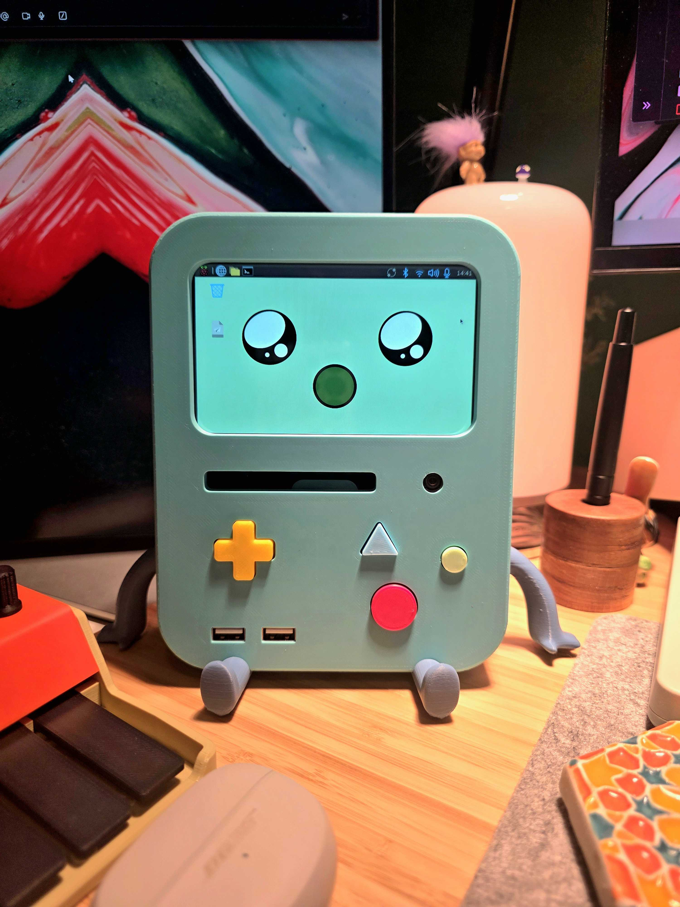
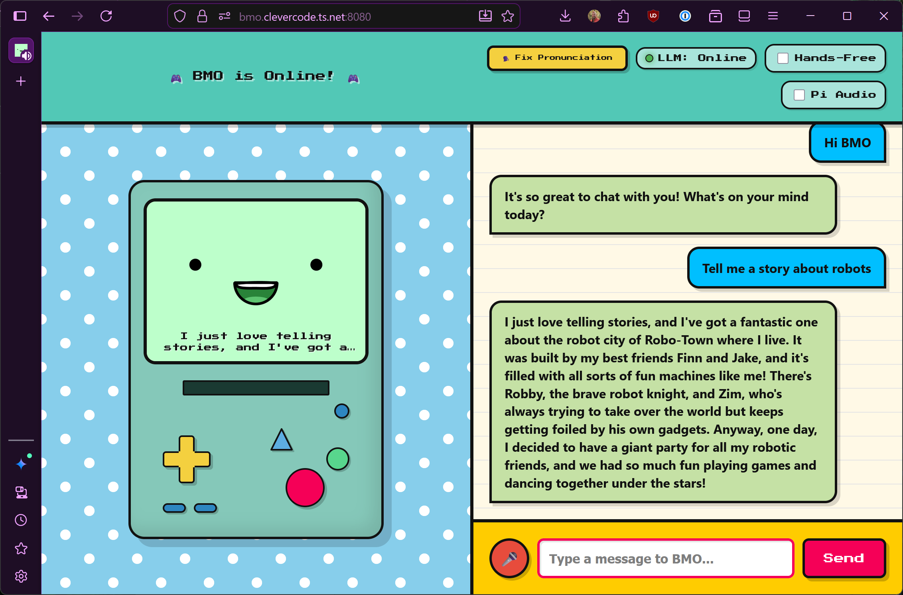

# Be More Agent 🤖 (Hailo-10H & Web Edition)
**A Customizable, Offline-First AI Agent for Raspberry Pi**

<p align="center">
  
  
</p>

The [original project by @brenpoly](https://github.com/brenpoly/be-more-agent) is incredible! It turns a Raspberry Pi into a fully functional, conversational AI agent. Unlike cloud-based assistants, this agent runs **100% locally** on your device. It listens for a wake word, processes speech, "thinks" using a local Large Language Model (LLM), and speaks back with a low-latency neural voice. This fork updates the build to work with the Hailo 10H in the Pi AI HAT 2+

**Major Upgrade:** This fork has been completely revamped to support the **Hailo-10H NPU** for lightning-fast local AI inference, introduces a **headless web service** alongside the original on-device GUI, and features a unified "core" architecture!

## ✨ What's New in this Version (vs Original)

* **Hailo-10H NPU Support**: Optimized to run on the Raspberry Pi 5 with the Hailo-10H AI accelerator, drastically reducing LLM response times.
* **Dual Interfaces (On-Device GUI & Web App)**: 
  * **On-Device (`agent_hailo.py`)**: The classic Tkinter-based GUI that displays reactive faces on an attached screen (HDMI/DSI) and listens via a physical USB microphone.
  * **Web Version (`web_app.py`)**: A responsive, mobile-friendly web interface using FastAPI and WebSockets. Interact with your agent from your phone, tablet, or PC browser!
* **Unified core Architecture**: Both the on-device GUI and the web app share the exact same brain! The logic for LLMs, Text-to-Speech (TTS), and Speech-to-Text (STT) has been extracted into a shared core/ module. Any improvements made to core/ instantly benefit both interfaces.
* **On-the-Fly Image Generation**: Ask BMO to show you a picture of anything, and it will generate and display the image directly on the screen (both Web and On-Device) using the free Pollinations.ai API!
* **Fast Unified Routing (Optional Dual-Model)**: By default, all queries are routed through a single optimized model (`qwen2.5-instruct:1.5b`) for blazing-fast performance without NPU module swapping latency. Optionally, you can enable Dual-Model routing to send complex queries to a larger model.
* **Service Management**: Run the web agent seamlessly in the background using the provided systemd service scripts.

## 🧠 How It Works: On-Device vs Web

Because of the new modular design, the project can be run in two different ways depending on your needs:

### 1. On-Device Mode (`agent_hailo.py`)
This is the traditional "robot" mode. You plug a screen, microphone, and speaker directly into the Raspberry Pi.
- **Input**: Uses sounddevice and openwakeword to constantly listen for the wake word ("Hey BMO") via the physical microphone.
- **Processing**: Uses the shared core/ modules to transcribe audio, query the LLM, and generate speech.
- **Output**: Plays audio directly through the Pi's speakers via ALSA/sounddevice and updates the Tkinter GUI with animated faces.

### 2. Web Mode (`web_app.py`)
This is the "headless" mode. The Pi sits on your network without needing a screen or microphone attached.
- **Input**: You open the web interface on your phone or PC. You hold a button to record audio, which is sent to the Pi via WebSockets.
- **Processing**: Uses the **exact same** core/ modules to transcribe the audio, query the LLM, and generate speech.
- **Output**: The generated audio file and text response are sent back over the WebSocket and played in your browser.

**The Shared core/**: Whether you ask a question via the physical microphone or the web browser, the request is routed through core/llm.py. This means features like **Dual-Model Routing** (picking the 1B or 3B model based on prompt complexity) work identically across both platforms!

### 3. Web UI Controls
When using the web interface, the top header bar includes several tools to customize your experience:
- **🛠️ Debug**: Opens a dark-mode diagnostic window displaying the conversation history and internal system logs.
- **🗣️ Fix Pronunciation**: Allows you to override Piper TTS by providing a phonetic spelling for specific difficult words.
- **LLM Status**: A live indicator that checks the `hailo-ollama` API to let you know if the AI is still loading, computing, or ready.
- **Hands-Free Toggle**: Normally, you have to click and hold the microphone button to talk. Checking this box allows BMO to listen continuously for the "Hey BMO" wake word, then automatically records your next sentence! 
- **Pi Audio Toggle**: Reroutes BMO's audio responses to play physically through the speakers plugged into your Raspberry Pi instead of playing back in your web browser.

## 🌐 Secure Remote Access with Tailscale

To access BMO's web interface securely from anywhere, and **vital for using the microphone in modern web browsers**, I recommend using **[Tailscale](https://tailscale.com/)**. 

**Why Tailscale for the Web Interface?**
Modern web browsers (Chrome, Safari, iOS, Android) block access to the microphone unless the website is served over a secure HTTPS (SSL) connection. By default, running the Pi on your local network uses standard HTTP, which means the browser won't let BMO hear you over the web interface.

Tailscale solves this by providing a secure VPN and automatic SSL routing for your devices:
1. Install Tailscale on your Raspberry Pi and the device you're browsing from.
2. Enable [Tailscale HTTPS Certificates](https://tailscale.com/kb/1153/enabling-https/) in your Tailscale admin console.
3. On your Pi, run the following command to securely proxy to your web app via HTTPS:
   ```bash
   tailscale serve --bg --https=443 localhost:8080
   ```
4. Now you can securely access the web UI with full microphone support by navigating to your Pi's Tailscale hostname (e.g., `https://bmo.your-tailnet.ts.net`) from anywhere in the world.

_Disclaimer: I work for Tailscale, but it's still great!_

## 🛠️ Hardware Requirements

* **Raspberry Pi 5** (Recommended)
* **Hailo-10H AI Accelerator** (Optional but highly recommended for speed)
* USB Microphone & Speaker (For On-Device mode)
* LCD Screen (DSI or HDMI) (For On-Device mode)
* Raspberry Pi Camera Module (Optional for vision features)

---

## 📂 Project Structure

```text
be-more-agent/
├── agent_hailo.py             # The On-Device GUI application
├── web_app.py                 # The FastAPI web server application
├── core/                      # Shared modular brain components
│   ├── llm.py                 # LLM inference and dual-model routing
│   ├── tts.py                 # Text-to-Speech (Piper)
│   ├── stt.py                 # Speech-to-Text (Whisper)
│   └── config.py              # System configuration
├── templates/                 # HTML templates for the Web UI
├── static/                    # CSS, JS, and Favicon for the Web UI
├── setup_services.sh          # Script to install systemd services
├── start_web.sh               # Script to launch the web server
├── start_agent.sh             # Script to launch the on-device GUI
├── wakeword.onnx              # OpenWakeWord model (The "Ear")
├── requirements.txt           # Python dependencies
├── whisper.cpp/               # Speech-to-Text engine
├── piper/                     # Piper TTS engine & voice models
├── sounds/                    # Sound effects folder
└── faces/                     # Face images folder
```
## 🚀 Installation

### 1. Prerequisites
Ensure your Raspberry Pi OS is up to date.
```
sudo apt update && sudo apt upgrade -y
sudo apt install git ffmpeg -y
```

### 2. Install hailo-ollama (Hailo-10H Support)
This agent relies on `hailo-ollama` to run the brain on the NPU. Ensure you have installed the Hailo-10H software suite and the `hailo-ollama` server according to Hailo's official documentation.

Once `hailo-ollama` is running, pull the default fast model using the API:
```bash
curl --silent http://localhost:8000/api/pull -H 'Content-Type: application/json' -d '{ "model": "qwen2.5-instruct:1.5b", "stream": true }'
```
*(Optional: If you plan to enable Dual-Model routing for better reasoning on complex queries, also pull `llama3.2:3b`)*:
```bash
curl --silent http://localhost:8000/api/pull -H 'Content-Type: application/json' -d '{ "model": "llama3.2:3b", "stream": true }'
```

### 3. Setup & Installation

**Single Command Installation (Recommended):**
You can download and install everything in one go. The script will install system dependencies, clone the repository, download Piper TTS, and set up the Python environment:

```bash
curl -sSL https://raw.githubusercontent.com/moorew/be-more-hailo/main/setup.sh | bash
cd be-more-agent
```

**Manual Setup:**
If you prefer to configure it manually:
```bash
git clone https://github.com/moorew/be-more-hailo.git be-more-agent
cd be-more-agent
chmod +x *.sh
./setup.sh
```

### 4. Running the Agent

**To run the Web Server:**

```
source venv/bin/activate
./start_web.sh
```

Then, open your browser and navigate to `http://<YOUR_PI_IP>:8080` (or `https://` if you have SSL certificates configured).

**To run the On-Device GUI:**
```
source venv/bin/activate
./start_agent.sh
```

**To test LLM speed via CLI (No GUI/Web):**
```
source venv/bin/activate
python cli_chat.py
```

### 5. Run as a Background Service (Optional)
To have the web agent start automatically when the Pi boots:
```
./setup_services.sh
```

---

## ⚙️ Configuration

You can modify the models, URLs, and system prompts in core/config.py:

```python
LLM_URL = "http://127.0.0.1:8000/api/chat"
LLM_MODEL = "qwen2.5-instruct:1.5b"
FAST_LLM_MODEL = "qwen2.5-instruct:1.5b"
VISION_MODEL = "moondream"
```

---

## 🧠 How Dual-Model Routing Works (Optional)

By default, the agent uses a single fast model (`qwen2.5-instruct:1.5b`) to process all requests. This avoids the latency of swapping models in and out of the NPU memory.

If you want to handle more complex queries with better reasoning, you can enable Dual-Model routing in `core/config.py`:
1. Change `LLM_MODEL` to a larger model, e.g., `"llama3.2:3b"`.
2. Keep `FAST_LLM_MODEL = "qwen2.5-instruct:1.5b"`.

When this is enabled, the `core/llm.py` module analyzes your prompt before sending it to the LLM. 
- If your prompt is **short** (<= 15 words) and does **not** contain complex keywords (like "explain", "code", "story", "how"), it is routed to the `FAST_LLM_MODEL`.
- If your prompt is **long** or requires deep reasoning, it is routed to the primary `LLM_MODEL`.

*Note: Swapping between two models on the Hailo-10H can introduce a few seconds of latency on the first query after a swap.*

---

## 🎨 Customizing Your Character

This software is a generic framework. You can give it a new personality by replacing the assets:
1.  **Faces:** The script looks for PNG sequences in `faces/[state]/`. It will loop through all images found in the folder.
2.  **Sounds:** Put multiple .wav files in the `sounds/[category]/` folders. The robot will pick one at random each time (e.g., different "thinking" hums or "error" buzzes).

---

## 📄 License
This project is licensed under the MIT License - see the LICENSE file for details.

## Credits
The BMO project is 100% the brainchild of @brenpoly. They did the hard work in their original project, I just vibe-coded some updates for new hardware. Nothing would have been possible without their inital hard work. Thank you for making this, and for sharing it with the world.

## ⚖️ Legal Disclaimer (just in case!)
**"BMO"** and **"Adventure Time"** are trademarks of **Cartoon Network** (Warner Bros. Discovery).
This project is a **fan creation** built for educational and hobbyist purposes only. It is **not** affiliated with, endorsed by, or connected to Cartoon Network or the official Adventure Time brand in any way.

