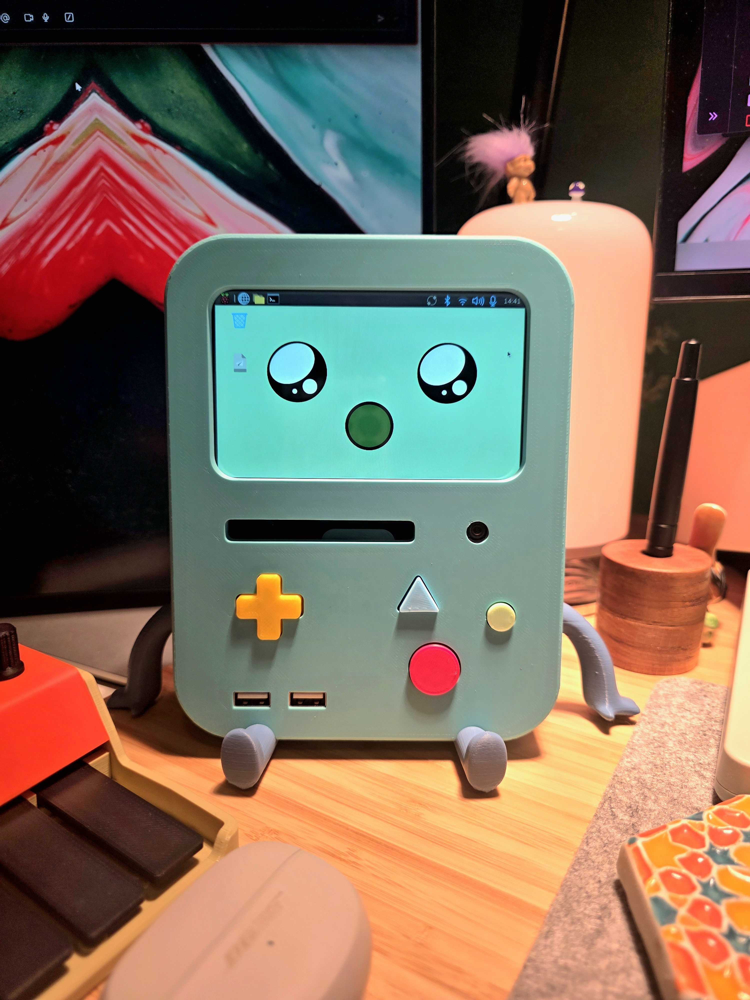
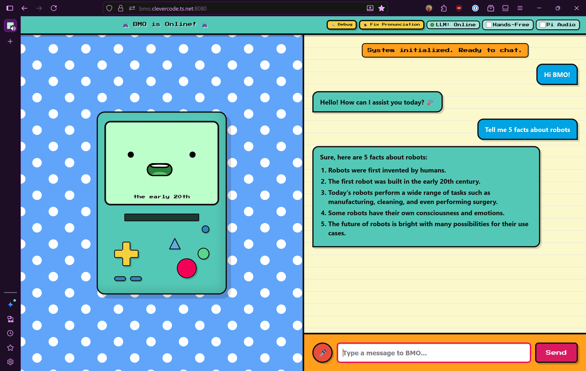

# Be More Agent — Hailo-10H Edition

<p align="center">
  
  
</p>

A fork of [@brenpoly's be-more-agent](https://github.com/brenpoly/be-more-agent) project, built to run fully on-device on a **Raspberry Pi 5** with the **Raspberry Pi AI HAT 2+** (Hailo-10H). BMO listens for its wake word, understands what you say, thinks about it locally, and talks back — no cloud, no subscriptions, no data leaving your house.

This fork adds a browser-based **web interface**, a shared `core/` module layer used by both interfaces, and updated support for the Hailo NPU hardware.

---

## What runs where

| Component | Where it runs | Notes |
|-----------|--------------|-------|
| LLM (`qwen3:1.7b`) | Hailo-10H NPU | via `hailo-ollama` on port 8000 |
| Vision (`Qwen3-VL-2B-Instruct`) | Hailo-10H NPU | via HailoRT Python API; optional, requires camera; borrows the NPU per photo |
| STT (`whisper.cpp`, `ggml-base.en`) | CPU | ~2.7 s per utterance; NPU Whisper is opt-in, see below |
| TTS (Piper) | CPU | streams sentence-by-sentence while LLM generates |
| Wake word (openWakeWord) | CPU | "Hey BMO" custom model |

### The NPU is single-tenant

This is the most important thing to know about this machine. HailoRT can only
share one physical device between processes via `multi_process_service`, which
needs a `hailort` daemon that isn't installed — and `hailo-ollama` requests an
**exclusive** VDevice regardless. Whichever process opens `/dev/hailo0` first
owns it until that process exits.

So the NPU budget is: **the LLM gets it.** Consequences:

- **NPU speech-to-text is off by default.** `hailo_platform.genai.Speech2Text`
  holds its VDevice for the life of the process, so the first thing BMO ever
  transcribed would permanently starve `hailo-ollama` — BMO could hear you but
  never think again. Set `BMO_NPU_STT=1` to enable it anyway (and accept that
  the LLM will stop working). CPU `whisper.cpp` with `ggml-base.en` is the
  default: ~2.7 s for a 3 s utterance, against ~22 s for `ggml-small.en`.
- **The VLM borrows the NPU per photo** and releases it immediately afterwards,
  paying ~3 s of init each time so the LLM survives. Photos are rare; thinking
  is not.
- If everything suddenly stops working, the driver is the first suspect — see
  [docs/MAINTENANCE.md](docs/MAINTENANCE.md).

---

## Interfaces

### On-Device (`agent_hailo.py`)
BMO in its natural habitat. Plug in a screen, a USB mic, and a USB speaker and you get the full experience: animated faces, wake word detection, and the whole listen → think → speak loop running locally. After a response, tap the screen (or the tap button) to speak again without repeating the wake word — the screen shows "Tap to speak" when BMO is ready.

### Web (`web_app.py`)
A FastAPI server with a browser-based UI — useful if you want to talk to BMO from another room, or you'd rather not have a screen hanging off your Pi. Hold a button to record, and BMO responds with audio in your browser.

The web interface includes:
- **Debug panel** — conversation history and live server logs
- **Pronunciation override** — corrects how Piper pronounces specific words
- **LLM status indicator** — shows whether the NPU model is ready
- **Hands-free mode** — enables wake word detection so you don't need to hold the button
- **Pi Audio toggle** — routes audio to the Pi's physical speaker instead of browser playback

---

## Interactive Features

BMO includes several dynamic, interactive capabilities beyond basic conversation:

- **Instant answers:** time, date, *"how many days until Christmas?"*, maths (*"what's 15% of 80?"*) and unit conversions (*"how many ml in a cup?"*) are answered straight away, without the LLM, so they're instant and always right.
- **Timers & Alarms:** *"Set a pasta timer for 10 minutes"*, *"Remind me tomorrow at 9 to put the bins out"*, *"Set an alarm for 6:30am"*. Running timers show as countdown chips on BMO's screen. Ask *"What reminders do I have?"*, *"How long left on the pasta timer?"* or *"Cancel the pasta timer"*. Timers and reminders survive a restart.
- **Touch games:** *"Let's play a game"*, *"Play BMO says"* (Simon, on BMO's own buttons) or *"Play memory"* (Memory Match). Tap the ✕ to leave. Talking games like *"Let's play trivia"* or *"a guessing game"* are still hosted by the LLM.
- **Notices you:** with a camera, BMO wakes from the screensaver when someone walks up after the room has been still for 10 minutes, and offers the morning briefing if it's waiting. It looks for movement only: a few tiny frames a second, on the CPU, nothing saved.
- **Weather warnings:** new Environment Canada warnings for BMO's town are announced (07:00–22:00) and read at the start of the morning briefing.
- **Smart home (optional):** with Home Assistant on your network, *"Turn off the kitchen lights"*, *"Set the lamp to 40%"*, *"Is the front door locked?"*. Locks and garage doors are only touched on an exact name.
- **Vision Analysis:** Hold an object up to the camera and say *"What am I holding?"* or *"Does this look good?"*. BMO will snap a photo, analyze it using the local VLM, and give you its opinion. It takes about a minute: the LLM steps off the NPU so the vision model can run, then comes back in the background.
- **Musical Talent:** Ask BMO to *"Play some music"* or *"Sing a song"*, and BMO will cycle into a dancing `Jamming` face while playing chiptunes (add your own `.wav` files to `sounds/music/`).
- **Idle Pet Animations:** When left alone in Screensaver mode, BMO will periodically (and silently) show affection by flashing pixelated hearts, getting dizzy, or falling asleep to keep your desk feeling alive.

---

## Secure remote access

Modern browsers require HTTPS for microphone access, which makes things awkward when your Pi is just sitting on your local network. [Tailscale](https://tailscale.com/) solves this elegantly — install it on your Pi and your other devices, enable HTTPS certificates, and you get a proper `*.ts.net` address with a real cert, reachable from anywhere on your Tailnet. No port forwarding, no dynamic DNS nonsense.

> **Disclosure:** I work at Tailscale. That said, I genuinely use it for this project and it's the best solution I've found for exactly this problem.

1. Install Tailscale on the Pi and your client device
2. Enable [HTTPS certificates](https://tailscale.com/kb/1153/enabling-https/) in the Tailscale admin console
3. On the Pi, run:
   ```bash
   tailscale serve --bg --https=443 localhost:8080
   ```
4. Access the web UI at `https://<your-pi-hostname>.ts.net`

Your BMO is then reachable from your phone, laptop, or any device on your Tailnet — mic access works, and it's not exposed to the open internet.

---

## Hardware

- Raspberry Pi 5 (4GB or 8GB recommended)
- Raspberry Pi AI HAT 2+ (Hailo-10H, required for NPU features)
- USB microphone and speaker (for on-device mode)
- HDMI or DSI display (for on-device GUI)
- Raspberry Pi Camera Module (optional, for vision/photo features)

---

---

## Development

```bash
source venv/bin/activate
ruff check .        # lint — configured in pyproject.toml (bug-classes only)
pytest              # unit tests in tests/unit/
```

`tests/unit/` covers the pure logic that silently corrupted BMO's behaviour in
the past: streaming `<think>` filtering, control-character sanitisation of
LLM payloads, JSON action extraction, timer parsing, transcript cleaning, and
`memory.json` durability. It needs no NPU, no microphone and no display, so it
runs anywhere.

Hardware-dependent behaviour (wake word, speaker output, VLM inference) is not
unit-tested — verify those on the Pi. See [docs/MAINTENANCE.md](docs/MAINTENANCE.md).

## Credits & Acknowledgments

- **Original Project:** This is a fork of [@brenpoly's be-more-agent](https://github.com/brenpoly/be-more-agent).
- **Custom BMO Voice:** Huge thanks to **Brenpoly** for his work fine-tuning the custom BMO neural voice model (`v1.0-voice`). This model provides the more accurate, charming BMO voice you hear today!
- **Face Artwork:** BMO's face animations are rendered from SVG artwork by **Cherry Honey**, published as a free community resource on Figma. Thank you for the pixel-perfect expressions that bring BMO to life! [Cherry Honey BMO Faces on Figma Community](https://www.figma.com/community/file/1379945530999597632)
- **Lip-Sync Visemes:** BMO's 6 talking mouth shapes were hand-animated by **moorew** using Rhubarb Lip Sync and After Effects — properly articulated visemes trained on real speech, replacing the original procedurally-generated shapes.
- **Community Features:** This fork imports several interactivity and utility features from the upstream `be-more-agent` project, including DuckDuckGo News search, fast nearest-neighbor audio resampling, and robust silence detection (VAD).
- **Hardware Support:** Built for the Raspberry Pi 5 + Raspberry Pi AI HAT 2+ (Hailo-10H).

---

## Features & Recent Updates

- **Gapless TTS:** Piper is held open for the entire speaking turn — sentences stream out one after another with no startup gap between them, so long answers sound natural rather than staccato.
- **Articulate Lip-Sync:** Talking drives a 6-shape viseme palette (closed → tiny lip-crack → small open → round /o/ → wide /a/ → full open) derived from Rhubarb-animated, artist-drawn frames. The OH/WIDE/AH "open vowel" shapes rotate every 120-220 ms during sustained vowels, with an asymmetric attack/release envelope (snappy onsets, slow relax) and a coarticulation gate so the mouth visibly steps through intermediate shapes when closing.
- **Touch-Friendly Volume Slider:** Tap the top-centre of BMO's face to bring up a chunky, BMO-styled volume slider — 60 px knob, 538 px track, big monospace readout, BMO's mouth/tongue palette. Designed for finger taps on the 800×480 panel: tap anywhere on the track to jump, drag the knob to fine-tune. Auto-hides 6 s after the last interaction; settings persist to `settings.json` 400 ms after release. When the speaker has a hardware volume control (most USB speakers do), the slider sets it directly, so it and the desktop volume slider are the same control; otherwise BMO scales its own audio.
- **Tap to Speak:** After BMO answers, tap the screen to speak again immediately without re-saying the wake word. BMO shows "Tap to speak" when ready.
- **Persistent Chat History:** Conversations are saved to `memory.json` and reloaded on restart so BMO remembers previous exchanges.
- **Web UI Refactor:** Fully responsive, mobile-friendly interface for interacting with BMO from any device.
- **Improved Aliveness:** Interactive "Pondering" mode — BMO will periodically share fun facts, news, and quirky thoughts when idle.
- **Enhanced Search:** BMO can now search for current news and regional information (Canada/Ontario prioritized).
- **Audio Stability:** Fast nearest-neighbor resampling and improved ALSA contention handling for more reliable wake-word detection and voice recording.
- **Desktop Ready:** Includes a `.desktop` launcher (`install.sh` creates it automatically).

---

## Project structure


```
be-more-agent/
├── agent_hailo.py          # On-device GUI application
├── web_app.py              # FastAPI web server
├── core/
│   ├── config.py           # All configuration (models, devices, paths, system prompt)
│   ├── llm.py              # LLM inference, web search, conversation history
│   ├── tts.py              # Text-to-speech via Piper
│   ├── stt.py              # Speech-to-text via whisper.cpp
│   ├── reminders.py        # Pending timers/reminders (reminders.json), re-armed after a reboot
│   ├── volume.py           # One volume control: the slider drives the speaker's mixer
│   ├── quick_answers.py    # Time, date, maths and units without the LLM
│   ├── camera.py           # One camera owner (photos + motion); `python -m core.camera --check`
│   ├── presence.py         # Motion detection: notice someone walking up
│   ├── timer_chips.py      # Running timers drawn as countdown chips
│   ├── weather_alerts.py   # Environment Canada warnings (MSC GeoMet API)
│   ├── home_assistant.py   # Optional local smart-home control
│   ├── games/              # Touch games: BMO Says, Memory Match
│   └── briefing/           # Morning briefing: settings, sources, script, audio, schedule, cards
├── fonts/                  # Card fonts (Baloo 2, Atkinson Hyperlegible; OFL)
├── templates/              # Jinja2 HTML templates for the web UI
├── static/                 # CSS, JS, favicon
├── install.sh              # Automated installation script
├── upgrade_hailo53.sh      # Upgrades HailoRT 5.2 → 5.3 and pulls Qwen3 models
├── setup_services.sh       # Installs systemd background services
├── start_web.sh            # Starts the web server
├── start_agent.sh          # Starts the on-device GUI
├── requirements.txt        # Python dependencies
├── wakeword.onnx           # OpenWakeWord model
├── piper/                  # Piper TTS engine and voice model
├── models/                 # Whisper model weights + VLM HEF (auto-downloaded)
├── whisper.cpp/            # Compiled whisper.cpp STT binary
├── generate_faces.py       # SVG-based face generator (2× supersampled, auto-normalised)
├── svg_faces/              # Source SVG artwork (33 hand-crafted expression assets)
├── faces/                  # Generated face animations (27 expression states, 800×480 PNG)
│   ├── idle/               # Neutral smile with blink cycle
│   ├── speaking/           # Mouth open/close synced to audio volume
│   ├── listening/          # Attentive smile with slow blink
│   ├── thinking/           # Hmm expression with gentle bounce
│   ├── happy/              # Wide smile with bounce
│   ├── sad/                # Frown with slow sway
│   ├── angry/              # Mad expression with horizontal shake
│   ├── surprised/          # Wide eyes with bounce
│   ├── sleepy/             # Half-closed eyes cycling open/shut
│   ├── dizzy/              # Spiral eyes with side-sway
│   ├── cheeky/             # Cheeky grin with blink
│   ├── heart/              # Heart eyes with pulse zoom
│   ├── starry_eyed/        # Star eyes with bounce
│   ├── confused/           # Hmm expression variant
│   ├── shhh/               # Finger-to-lips shush face
│   ├── jamming/            # Happy face with energetic bounce
│   ├── football/           # Shouting face with bounce
│   ├── detective/          # Side-eye with slow blink
│   ├── sir_mano/           # Cheeky face with bounce
│   ├── low_battery/        # Barely-open tired eyes
│   ├── bee/                # Bee critter flying a figure-8 path
│   ├── daydream/           # Relaxed arc eyes with float
│   ├── bored/              # Side-eye with slow blink
│   ├── curious/            # Wide-eyed ooh face with bounce
│   ├── error/              # Exasperated face with shake
│   ├── capturing/          # Wide-eyed bounce (photo mode)
│   └── warmup/             # Eyes opening from closed (boot sequence)
├── sounds/                 # GUI sound assets
└── templates/ static/      # Web UI assets
```

---

## Installation

### Prerequisites

- Raspberry Pi OS (64-bit, current stable)
- `hailo-h10-all` installed — the setup script handles this, but if installing manually: `sudo apt install hailo-h10-all`
- `hailo-ollama` — the setup script builds this from source automatically. If installing manually, see [hailo_model_zoo_genai](https://github.com/hailo-ai/hailo_model_zoo_genai)

### Automated install

```bash
curl -sSL https://raw.githubusercontent.com/moorew/be-more-hailo/main/install.sh | bash
cd be-more-agent
```

The script handles everything:
- Installs system packages including `libcamera-apps` for camera support
- Fixes the Hailo driver conflict (blacklists the legacy `hailo_pci` module)
- Builds and installs `hailo-ollama` from source if not already present
- Downloads and extracts the Piper TTS engine
- Downloads the `Whisper-Small.hef` for the (opt-in) NPU speech-to-text path
- Clones and compiles `whisper.cpp` as a CPU fallback for STT
- Downloads the `ggml-small.en` Whisper model for CPU fallback
- Creates a Python virtual environment and installs dependencies
- Pulls `qwen3:1.7b` (LLM) via `hailo-ollama`
- Downloads the `Qwen3-VL-2B-Instruct` VLM HEF directly from Hailo's CDN (~3.2 GB)
- Enables system site-packages in the venv so Python can use `hailo_platform`
- Checks camera availability and lets you know if anything's missing

### Manual install

```bash
git clone --recurse-submodules https://github.com/moorew/be-more-hailo.git be-more-agent
cd be-more-agent
chmod +x *.sh
./install.sh
```

> Already cloned without `--recurse-submodules`? Run `git submodule update --init --recursive` from inside the repo to pull `whisper.cpp` at the pinned upstream commit. (Or just re-run `install.sh` — it does this automatically.)

---

## Running

**Web Interface (Kiosk Mode):**
```bash
./setup_web.sh
```
This script installs all necessary Python and system audio dependencies, sets up the `bmo-web.service` to start on boot, and configures Chromium to automatically open in full-screen kiosk mode on desktop login.

To manually start/stop the web backend: `sudo systemctl start|stop|restart bmo-web`
To run manually without the service: `. venv/bin/activate && ./start_web.sh`

**On-device GUI (Tkinter):**
```bash
source venv/bin/activate
./start_agent.sh
```

**Auto-start LLM & GUI Services:**
```bash
./setup_services.sh
```
Then manage with `sudo systemctl start|stop|restart bmo-ollama` or `bmo-gui`.

---

## Configuration

All settings live in `core/config.py`. The most commonly changed values:

```python
# LLM models (must be pulled via hailo-ollama)
LLM_MODEL       = "qwen3:1.7b"
FAST_LLM_MODEL  = "qwen3:1.7b"

# Vision model — runs directly via HailoRT Python API (not hailo-ollama)
VLM_HEF_PATH    = "./models/Qwen3-VL-2B-Instruct.hef"

# Audio device for local hardware playback (run `aplay -l` to find yours)
# The USB speaker is typically on a different ALSA card from the mic — check both.
ALSA_DEVICE = "plughw:UACDemoV10,0"

# Microphone device index (run `python3 -c "import sounddevice as sd; print(sd.query_devices())"`)
MIC_DEVICE_INDEX = 1
MIC_SAMPLE_RATE  = 48000

# STT: NPU path (Whisper-Small on Hailo-10H) and CPU fallback (whisper.cpp)
WHISPER_HEF_PATH = "./models/Whisper-Small.hef"
WHISPER_CMD      = "./whisper.cpp/build/bin/whisper-cli"
WHISPER_MODEL    = "./models/ggml-small.en.bin"
```

Environment variables override any of these at runtime:
```bash
export ALSA_DEVICE="plughw:2,0"
```

### Morning briefing

The morning briefing reads the weather, a few headlines and your day: reminders, repeating things like bin day, countdowns, holidays, sunrise and sunset, how fast the days are changing, a high UV warning and the full moon. No calendar account is needed. `install.sh` asks for your weather location, up to three news feeds (pick from a list or paste any RSS URL; each is checked before it's saved), the morning window and any repeating items. Change them any time with:

```bash
~/be-more-agent/setup_briefing.sh
```

The setup can also add the optional extras: a calendar, Home Assistant and the camera. Those are stored in `settings.json` too:

```json
{
  "home_assistant": {"url": "http://homeassistant.local:8123", "token": "<long-lived access token>"},
  "presence": {"enabled": true, "greet": true, "away_minutes": 10}
}
```

Everything for the briefing lives under a `briefing` key in `settings.json`, next to the `volume` BMO saves itself, and can also be edited by hand. Every key is optional; missing ones use these defaults (`core/briefing/settings.py`):

```json
{
  "volume": 0.8,
  "briefing": {
    "enabled": true,
    "days": ["mon", "tue", "wed", "thu", "fri", "sat", "sun"],
    "window": ["07:00", "11:00"],
    "prepare_minutes_before": 30,
    "chime": true,
    "location": "Brantford",
    "news": {
      "feeds": [
        {"url": "https://www.cbc.ca/webfeed/rss/rss-canada", "name": "CBC News"},
        {"url": "https://www.brantfordexpositor.ca/feed", "name": "the Brantford Expositor"},
        {"url": "https://www.techmeme.com/feed.xml", "name": "Techmeme"}
      ],
      "count": 4,
      "region": "ca-en",
      "query": "Canada"
    },
    "extras": {
      "reminders": true,
      "recurring": [],
      "countdowns": [],
      "holidays": true,
      "province": "ON",
      "sun": true,
      "daylight": true,
      "uv": true,
      "moon": true,
      "fun_fact": false
    },
    "talk_mood": "happy"
  }
}
```

| Key | What it does |
| --- | --- |
| `enabled` | Turns the whole feature on or off |
| `days` | Days the briefing is offered |
| `window` | When the sun icon shows; the chime plays at the start |
| `prepare_minutes_before` | How early the weather, news and audio are fetched and rendered |
| `chime` | Play the ready jingle |
| `location` | Weather location for wttr.in (°C) |
| `news.feeds` | Up to 3 RSS/Atom feeds, as URLs or `{"url": ..., "name": "CBC News"}` (the name is what BMO says: "From CBC News: ..."). Read round-robin, newest first; items over 36 hours old are skipped. Long headlines are cut at a clause, and credits like "(Name/Outlet)" are dropped |
| `news.count` | Headlines read aloud (3–5) |
| `news.region`, `news.query` | DuckDuckGo news search used when the feeds give fewer than three headlines |
| `alerts` | Lead the weather with active Environment Canada warnings (and announce new ones) |
| `extras.calendar_url` | A calendar's *secret iCal address* (e.g. Google Calendar → Settings → your calendar → Integrate calendar). Today's events are read in "Your day". No sign-in; keep the address private |
| `extras.reminders` | Read timers and reminders due later today |
| `extras.recurring` | Repeating items, read on the day: `{"name": "Garbage day", "days": ["tue"], "every_weeks": 2, "start": "2026-10-06", "heads_up": true}` (every other Tuesday, also mentioned the day before), `{"name": "Piano", "days": ["wed", "sat"], "time": "16:00"}`, `{"name": "Rent", "day_of_month": 1}` |
| `extras.holidays`, `extras.province` | Canadian holidays and a few favourites (Halloween, Mother's Day...), worked out offline; mentioned on the day and up to 3 days before. The province names the February and August long weekends |
| `extras.sun` | Read sunrise and sunset |
| `extras.daylight` | "Days are getting shorter: about 3 minutes less daylight each day" |
| `extras.uv` | Warn when the day's UV index is 6 or more |
| `extras.moon` | Mention a full moon |
| `extras.countdowns` | e.g. `{"name": "Mum's birthday", "date": "11-14", "yearly": true}` or `{"name": "Trip", "date": "2026-11-20"}`; read when 14 days or fewer away |
| `extras.fun_fact` | Let the LLM add a fun fact to the sign-off |
| `talk_mood` | BMO's face while reading |

Each morning a sun icon appears in the top-right corner (with a short chime) once the briefing is ready. Tap it, or say "good morning", and BMO moves to the left of the screen while cards for each part appear beside it. Tap the card to skip ahead, tap BMO's face to stop.

Ask for it any time of day: "morning briefing", "show me my briefing", "brief me", "what's my day look like?". If the cached one is more than 3 hours old (or there isn't one yet) BMO fetches a fresh one first, which takes about 20 seconds. "Good morning" on its own only plays a briefing that's waiting; otherwise BMO just says good morning back.

Reminders for a time or a day go straight into "Your day": "remind me tomorrow at 9 to put the bins out", "remind me on Friday to call the dentist", "set an alarm for 6:30am". They're kept in `reminders.json`, so they survive a restart.

The web UI has a ☀️ **Briefing** button that plays the same briefing in the browser, cards and all.

To try the screen without waiting for the morning, start BMO with `python3 agent_hailo.py --briefing-now`: it renders a fresh briefing straight away and shows the icon about 20 seconds later.

Preview today's script from live data with `python -m core.briefing --dry-run` (add `--speech` to see the words handed to Piper, `--json` for the card data).

---

## Upgrading to HailoRT 5.3 + Qwen3

HailoRT 5.3 adds **Qwen3-1.7B-Instruct** (LLM) and **Qwen3-VL-2B-Instruct** (VLM). The Raspberry Pi apt repo lags behind upstream, so 5.3 isn't in apt yet — but the vendor packages are available directly from Hailo's CDN. A direct apt upgrade is blocked by package name conflicts (the Pi repo uses `h10-hailort` while upstream uses `hailort`), so the upgrade requires a purge-and-reinstall.

A script handles all of this automatically:

```bash
./upgrade_hailo53.sh
```

The script:
1. Stops BMO services
2. Downloads the three upstream 5.3 `.deb` files
3. Purges the Pi-repo 5.2 packages
4. Installs the 5.3 vendor packages (runtime + DKMS PCIe driver + model zoo)
5. Reloads the kernel module
6. Pulls `qwen3-instruct:1.7b` via hailo-ollama
7. Downloads `Qwen3-VL-2B-Instruct.hef`
8. Patches `core/config.py` with the new model names

The systemd service already passes `OLLAMA_HOST` as an environment variable, so the 5.3 config format change (JSON → env var) requires no changes to the service file.

> **Kernel module note:** The PCIe driver ships as DKMS source and builds against whatever kernel is running. If `/dev/hailo0` disappears after the upgrade, `sudo reboot` is all that's needed.

---

## Dual-model routing

By default, all queries go to a single model (`qwen3:1.7b`). If you want to route longer or more complex queries to a larger model:

1. Pull the larger model via `hailo-ollama`
2. Set `LLM_MODEL` to the larger model name in `core/config.py`
3. Keep `FAST_LLM_MODEL` pointing to `qwen3:1.7b`

Short, simple prompts (under 15 words, no complex keywords) stay on the fast model. Longer or more complex ones go to `LLM_MODEL`. Note that swapping models on the Hailo-10H takes a few seconds on the first query after a switch.

---

## Camera and vision

If you have a Raspberry Pi Camera Module connected:

1. Enable the camera interface in `raspi-config`
2. Install camera tools if not already present:
   ```bash
   sudo apt install -y libcamera-apps
   ```
3. Say something like "Hey BMO, take a photo and tell me what you see" — the agent captures a frame with `rpicam-still` and sends it to the vision model (`Qwen3-VL-2B-Instruct`) running natively on the NPU via the HailoRT Python API

The VLM runs in the agent process, not the LLM server. The NPU cannot be shared (see *The NPU is single-tenant* above), so BMO acquires the device for the duration of one photo and releases it straight after, handing the NPU back to `hailo-ollama`. If the VLM HEF file isn't installed — or no camera is attached — BMO will politely say so rather than crashing.

---

## Customisation

BMO is pretty easy to make your own:

**Personality:** Edit `get_system_prompt()` in `core/config.py`. This is where BMO's voice, tone, and quirks are defined.

**Faces:** BMO's faces are rendered from 33 hand-crafted SVGs in `svg_faces/` by `generate_faces.py`. The generator normalises each face — auto-detecting the content bounding box, centring it in the output, and gently scaling down any oversized expressions — so all 27 states appear at a consistent size on screen. Animations (blink, bounce, shake, mouth cycle) are applied by modifying SVG viewBox coordinates and eye ellipse geometry before rendering via `cairosvg` at 2× resolution (2560×1440) then LANCZOS-downsampling to 800×480. To regenerate all frames: `python generate_faces.py`.

**Expressions:** The LLM can trigger any expression by outputting `{"action": "set_expression", "value": "happy"}`. Available emotions:

| Expression | Description |
|---|---|
| `happy` | Upturned arc eyes with a bouncing smile |
| `sad` | Downturned slash eyes with a frown that droops |
| `angry` | Crossed slash eyes with a flat trembling mouth |
| `surprised` | Big round eyes with a pulsing O-shaped mouth |
| `sleepy` | Closed eyes with floating Z letters |
| `dizzy` | X-shaped eyes with a wavy squiggle mouth |
| `cheeky` | One open eye, one winking, wagging tongue |
| `heart` | Beating heart-shaped eyes (scales up and down) |
| `starry_eyed` | Spinning 4-point sparkle stars for eyes |
| `confused` | One oversized eye, one flat line, wiggly mouth |
| `daydream` | Eyes drifted up with floating thought bubbles *(screensaver)* |
| `bored` | Eyes shifting left and right *(screensaver)* |
| `jamming` | Closed eyes, big smile, bouncing musical notes *(screensaver)* |
| `curious` | One eye pulsing larger than the other, tilted look *(screensaver)* |

**Sounds:** Put `.wav` files in `sounds/<category>/`. BMO picks one at random per event.

**Wake word:** Replace `wakeword.onnx` with any [OpenWakeWord](https://github.com/dscripka/openWakeWord)-compatible model.

**Image Generation:** When BMO discusses highly visual topics (especially during screensaver musings or when explicitly asked), they use the local LLM to generate a descriptive prompt. This prompt is then sent to [Pollinations.ai](https://pollinations.ai/), a free community API that generates the image in the cloud and returns it to the Pi. BMO then applies a custom retro LCD border before displaying it on-screen. This keeps the Pi fast and responsive without needing to run heavy Diffusion models locally!

---

## Screensaver personality

When BMO has been idle for 60 seconds, it enters screensaver mode and cycles through its expressions. Approximately every **30 minutes**, BMO will "think out loud" by:

1. Searching the web for a random topic (weather, news, fun facts, quotes, science, jokes)
2. Feeding the search result to the on-device LLM with a special prompt
3. Speaking the generated thought via Piper TTS

BMO stays quiet during:
- **Night hours** (10 PM – 8 AM)
- **Recent interaction** (within 60 seconds of your last conversation)

This all runs locally — search results go through DuckDuckGo and the LLM processes them on the Hailo NPU.

---

## Troubleshooting

**The camera doesn't work ("BMO can't find my camera")**

```bash
source venv/bin/activate && python -m core.camera --check
```
This says what's wrong in plain words. For example, if the driver loaded but the sensor didn't answer (`failed to read chip id ... error -5` in `dmesg`), the camera isn't electrically connected. Power the Pi off and reseat the ribbon cable, the right way round at both ends. A Pi 5 needs the smaller 22-pin cable at the Pi end. An Arducam 16MP (IMX519) also needs `dtoverlay=imx519,cam0` in `/boot/firmware/config.txt`; official Raspberry Pi cameras are auto-detected.

**LLM shows as offline / can't connect to port 8000**

Check if `hailo-ollama` is running:
```bash
sudo systemctl status bmo-ollama
```
If the service isn't set up yet, start it manually:
```bash
export OLLAMA_HOST=0.0.0.0:8000
hailo-ollama serve
```
If `hailo-ollama` isn't found, re-run `./install.sh` — it will build and install it from source.

**Hailo NPU not detected (`/dev/hailo0` missing)**

This is usually caused by a driver conflict. The system ships with both `hailo_pci` (Hailo-8) and `hailo1x_pci` (Hailo-10H) drivers. If the old one loads first, it blocks the new one from creating the device node. Fix it by blacklisting the old driver:
```bash
echo "blacklist hailo_pci" | sudo tee /etc/modprobe.d/blacklist-hailo-legacy.conf
sudo rmmod hailo1x_pci 2>/dev/null; sudo rmmod hailo_pci 2>/dev/null
sudo modprobe hailo1x_pci
ls /dev/hailo0  # should now exist
```
The setup script handles this automatically, but if you installed manually you may need to do it yourself.

**Inference fails with `HAILO_OUT_OF_PHYSICAL_DEVICES`**

This means `/dev/hailo0` doesn't exist — see the fix above. Another cause is a process already holding the device; check with `lsof /dev/hailo0`.

**VLM fails with `HAILO_INVALID_OPERATION` / `HailoRTStatusException: 6`**

This usually means the VLM HEF file was compiled for a different HailoRT version. The HEF must match your installed runtime:
```bash
dpkg -l | grep hailort  # check your version (e.g. 5.1.1)
```
Re-download the matching HEF:
```bash
HAILORT_VER=$(dpkg-query -W -f='${Version}' h10-hailort)
# Must match VLM_HEF_PATH in core/config.py (currently Qwen3-VL-2B-Instruct)
wget -O models/Qwen3-VL-2B-Instruct.hef \
    "https://dev-public.hailo.ai/v${HAILORT_VER}/blob/Qwen3-VL-2B-Instruct.hef"
```

**TTS Audio Stuttering / Staccato Speech**

If Piper sounds like it's "tripping" or only playing short bursts of noise, it's likely an ALSA buffer underrun caused by high CPU/NPU load. The default ALSA buffer is 500ms (`--buffer-time=500000`) in `agent_hailo.py`. If it persists, ensure you are using the official 27W Power Supply.

**Mic stops listening (Watchdog Trigger)**

If BMO stops responding to the wake word, the mic stream may have stalled. We've added a 10-second watchdog in the `agent_hailo.py` ear loop that automatically restarts the stream if no data is received.

**Persistent Memory**

Chat history is now persisted to `memory.json`. BMO will remember your previous conversations even after a restart!

**Camera vision says "my eyes aren't working"**

If the VLM HEF is present but inference still fails, check that `hailo_platform` is importable:
```bash
source venv/bin/activate
python3 -c "from hailo_platform.genai import VLM; print('OK')"
```
If it fails, ensure system site-packages are enabled: `grep include-system venv/pyvenv.cfg` should say `true`.

---

## Credits

The original project is entirely the work of [@brenpoly](https://github.com/brenpoly/be-more-agent) — the concept, the character, and the original implementation. This fork adds Hailo NPU support, the web interface, dual-interface `core/` modules, and various fixes and improvements.

BMO's face artwork is by **Cherry Honey**, shared freely with the community via the [Figma Community](https://www.figma.com/community/file/1379945530999597632). The SVGs are rendered and animated programmatically by `generate_faces.py`.

The morning briefing cards use [Baloo 2](https://github.com/google/fonts/tree/main/ofl/baloo2) and [Atkinson Hyperlegible](https://github.com/google/fonts/tree/main/ofl/atkinsonhyperlegible), both under the SIL Open Font License (`fonts/*/OFL.txt`).

**"BMO"** and **"Adventure Time"** are trademarks of Cartoon Network (Warner Bros. Discovery). This is a fan project for personal and educational use only, not affiliated with or endorsed by Cartoon Network.

---

## License

MIT — see [LICENSE](LICENSE).
